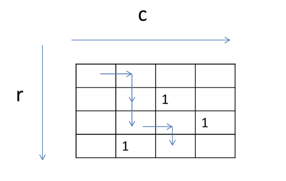

# 3SAT questions in general using dynamic programming
## Question description
This question generally uses the dynamic programming. and there are some levels checking whether a clause is satisfiable or not. similar like this question. it is like:
1. first, try the first function if fail it calls the second choice.
1. try the second function. if also fail return false
1. this function usually have if statement as recursion.
## solution for sat

```java
private static Environment solve(ImList<Clause> clauses, Environment env) {
        // Data:
        Clause emptyClause = new Clause();      // used to check for an empty clause

        // Finding minimum clause size
        int i = 100;
        Iterator<Clause> iterCl = clauses.iterator();
        while(iterCl.hasNext()) {
            i = Math.min(iterCl.next().size(), i);
        }

        // Case 1:
        if (clauses.isEmpty()){         // checking if there are no clauses left.
            return env;
        }

        // Case 2:
        else if (clauses.contains(emptyClause)){        // checking if there are any clauses which are empty.
            return null;    // returning null cause this Problem can't be solved.
        }

        // Case 3:
        else {
            Iterator<Clause> clauseIter = clauses.iterator();   // creates an iterator for ImList<Clause>
            while (clauseIter.hasNext()){
                Clause currentClause = clauseIter.next();
                if (currentClause.size() == i){         // checks if the size of the clause is i.
                    Literal chosenLit = currentClause.chooseLiteral();      // chooses a random literal from the clause
                    if (chosenLit instanceof PosLiteral) {      // if the chosen lit is positive, put itself into the environment.
                        env = env.putTrue(chosenLit.getVariable());
                    }
                    else {                                      // if the chosen lit is negative, put its negation into the environment.
                        env = env.putFalse(chosenLit.getVariable());
                    }

                    ImList<Clause> newclauses = substitute(clauses, chosenLit);     // calls substitute

                    Environment output = solve(newclauses, env);

                    if ((output == null) && (env.get(chosenLit.getVariable())==Bool.TRUE)){         //chosenLit instanceof PosLiteral
                        Literal negatedChosenLit = chosenLit.getNegation();
                        if (chosenLit instanceof PosLiteral) {
                            env = env.putFalse(chosenLit.getVariable());
                        }
                        else {
                            env = env.putTrue(chosenLit.getVariable());
                        }

                        ImList<Clause> newerclauses = substitute(clauses, negatedChosenLit);
                        return solve(newerclauses, env);
                    }
                    else if ((output == null) && (env.get(chosenLit.getVariable())==Bool.FALSE)){        //chosenLit instanceof NegLiteral
                        return null;
                    }

                    else {
                        return output;
                    }
                }
            }
        }
        return null;
    }
```

## finding path for Robot

### problem:
A robot starts from the upper left corner of a grid (0,0) and attempts to move to spot (r,c). At every step, the robot can only move in two directions: right and down. Some spots are “blocked”, such that the robot cannot step on these positions. Design a static method getPath (inside a new class GetPath) to find a path for the robot to move from the top left (0,0) to a spot (r,c), recursively. The method returns true and the path, if such a path can be found, or false if such a path cannot be found.
The grid is represented as an integer 2-d array: a ‘0’ indicates the spot is non-blocked, a ‘1’ indicates the spot is blocked. The starting point (0,0) is always non-blocked.
In the method: public static boolean getPath (int r, int c, ArrayList<Point> path, final int [][] grid)
The arguments r, c specify the destination spot. The method returns true if a path can be found, returned in path. The grid is passed in as the last input argument grid.
### analyse:
try one solution first, if true, return true, if not true, call the other function until try all the combination.

the key is 
### code
```java
import java.util.ArrayList;

public class GetPath {
    public static boolean getPath (int r, int c, ArrayList<Point> path, final int [][] grid) {
        if (path.size() == 0) {
            path.add(new Point(0, 0));
            return GetPath.getPath(r, c, path, grid);
        } else {
            Point LastP = path.get(path.size()-1);
            // horizontal move
            if (LastP.x == c && LastP.y == r-1) {
                path.add(new Point(r, c));
                return true;
            } else if(LastP.x == c-1 && LastP.y == r) {
                path.add(new Point(r, c));
                return true;
            } else if (LastP.x < c && LastP.y <= r && (grid[LastP.y][LastP.x+1] == 0)) {
                path.add(new Point(LastP.y, LastP.x+1));
                if (GetPath.getPath(r, c, path, grid)) {
                    return true;
                } else {
                    path.remove(path.size()-1);
                    // second case
                    if(LastP.y < r && LastP.x <= c && (grid[LastP.y+1][LastP.x] == 0)) {
                        path.add(new Point(LastP.y+1, LastP.x));
                        if (GetPath.getPath(r, c, path, grid)) {
                            return true;
                        } else {
                            path.remove(path.size()-1);
                            return false;
                        }
                    } else {
                        return false;
                    }

                }
            } else if(LastP.y < r && LastP.x <= c && grid[LastP.y+1][LastP.x] == 0) {
                path.add(new Point(LastP.y+1, LastP.x));
                if (GetPath.getPath(r, c, path, grid)) {
                    return true;
                } else {
                    path.remove(path.size()-1);
                    // first case
                    if(LastP.x < c && LastP.y <= r && (grid[LastP.y][LastP.x+1] == 0)) {
                        path.add(new Point(LastP.y, LastP.x+1));
                        if (GetPath.getPath(r, c, path, grid)) {
                            return true;
                        } else {
                            path.remove(path.size()-1);
                            return false;
                        }
                    } else {
                        return false;
                    }
                }

            } else {
                return false;
            }

        }
    }
}

class Point {
    int x;
    int y;

    Point (int x, int y) {
        this.x=x;
        this.y=y;
    }

    public String toString() {
        return "(" + x + "," + y + ")";
    }
}
```