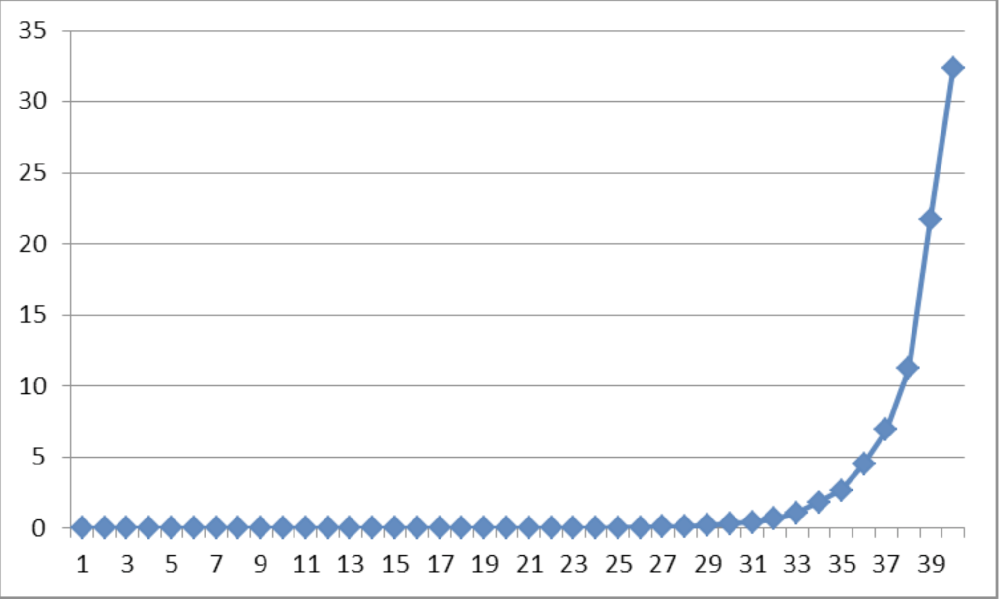
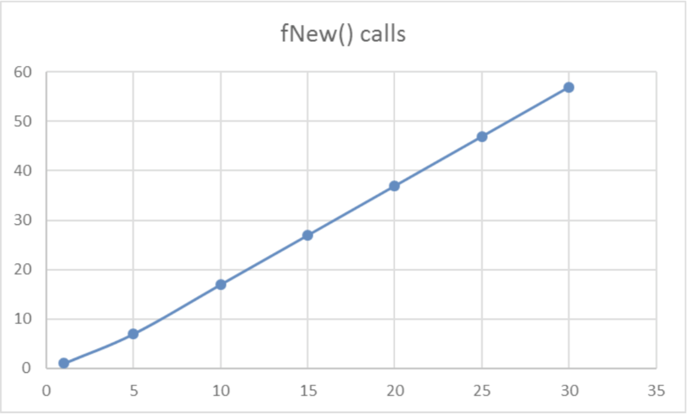
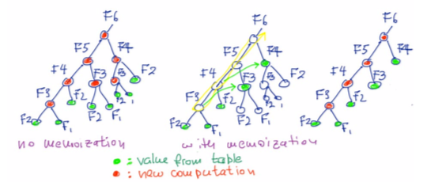

# Fibonacci
## Without memoization
The time complexity of using recursion to calculate fibonacci sequence is exponential. like the following code.
```python
def f(n):
    if n <= 2:
        return 1
    else:
        return f(n-1) + f(n-2)
```
Time complexity: 
The running time of this algorithm grows exponentially with n.


### with memoization
With memoization, we need to instantiate a hashtable to store all the values we calculated so we dont need to calculate them again.

It must be a hashtable as find the key will only take O(1) time.
```python
def fib(n, memo):
    fib.count += 1
    if str(n) in memo.keys():
        return memo[str(n)]
    if n == 1 or n == 2:
        return 1
    else:
        memo[str(n-1)] = fib(n-1, memo)
        memo[str(n-2)] = fib(n-2, memo)
        return memo[str(n-1)] + memo[str(n-2)]

def fibn(n):
    memo = {}
    fib.count = 0
    return fib(n, memo), fib.count
```
Time complexity: 
The time complexity is O(n).



## Analyze
1. We only need to calculate what is stored in the table, and the complexity = O(table_size). and the table size is O(n).
2. Without memo, we need to calculate tree structure. but with memo, we can calculate linear structure



# Factorial
But trying memoization method on factorial does not give any improvement as it is does not contain any trees. Therefore it is not dynamic programming (although it uses recursion)

With memo
```python
def factorial_memo(n):
    if str(n) in memo.keys():
        return memo[str(n)]
    if n == 1:
        return 1
    else:
        memo[str(n)] = n*factorial(n-1)
        return memo[str(n)]
```
without memo
```py
def factorial_normal(n):
    if n == 1:
        return 1
    else:
        return n*factorial_normal(n-1)
```