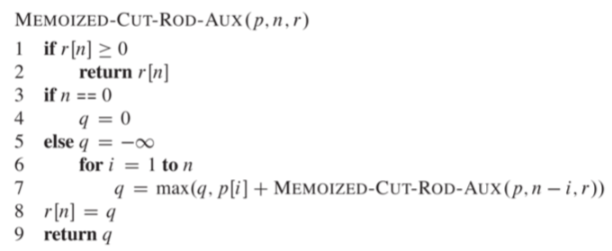
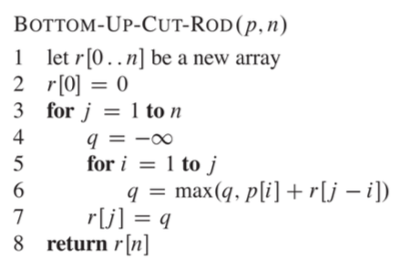

# Question3
## knapsack problem
you have a bag of capacity C, and you have some items in you bag and they have some weights and values. try to maximize the amount of weights you have, return the amount of value you need to have

e.g. the items you have

Weight(kg) | 1| 2| 4| 2| 5
___________________________
Value      | 5| 3| 5| 3| 2

## Solution
solution1 -- have or not:
```python
arr[n][C] = undefined
def KS(n, C):
    if arr[n][C] != undefined:
        return arr[n][C]
    if n==0 or C==0:
        result = 0
    else if w[n] > C:
        result = KS(n-1, C)
    else:
        tmp1 = KS(n-1, C)
        tmp2 = V[n] + KS(n-1, C - w[n])
        result = max(tmp1, tmp2)
    arr[n][C] = result
    return result
```
solution2 -- top down:

Solution3 -- bottom up:


## Run time
run time analysis of this memoized program. O(nC). n is # of items and C is capacity.
