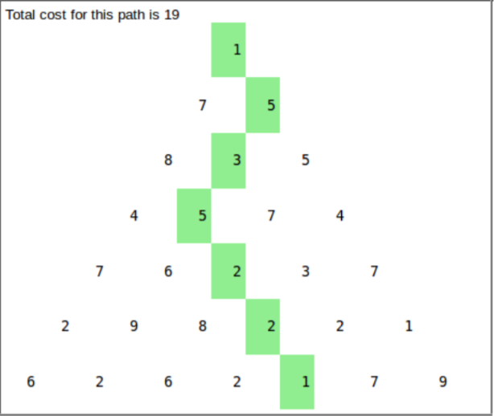
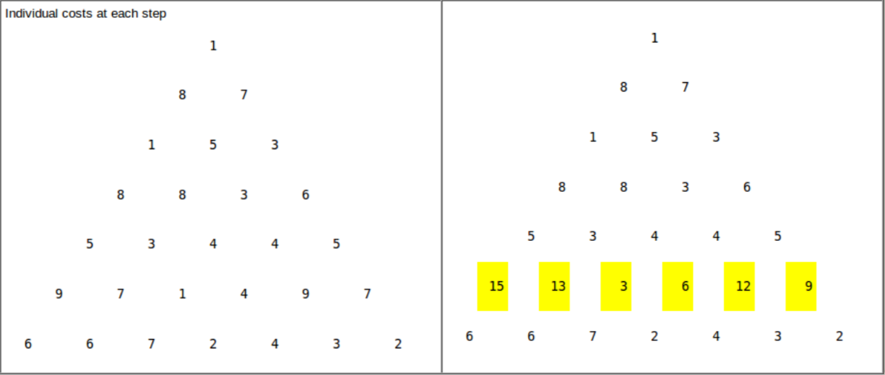

# Decision
All these questions have something in common. making decisions, whether it is finding the minimum or finding the maximum of the subproblems.

# Question1
We have a pyramid like this. what is the best path to go from the bottom to the top. each time we can only go to left or right.


## Greedy approach, may not be the best answer.
At every decision, we choose the next best possible answer.


We can either get 21 or 24.

## DP
add up the bottom min{left, right} to the top, do like this all the way to the top.


Similar algorithms [Viterbi decode](https://en.wikipedia.org/wiki/Viterbi_decoder)

# Question2
Your team has a list of job assignments to finish, each requiring a certain amount of time to complete. Your team has exactly 3 members to work on these assignments. Each member can only work on one assignment at a time.  Once a member starts an assignment, s/he must complete that before taking up another assignment. Being effective and hard-working software developers, the team members do not require any break between the job assignments.
 
Can you write a static method to determine the smallest amount of time your team will need to finish all the job assignments, given the list of assignments to complete? 

## The difficulty is too understand that we need to allocate it to small first.
## solution 
```java
public static int computeTimeFinish(ArrayList<Integer> l) {
       // TODO: implement computeTimeFinish method
        ArrayList<Integer> time = new ArrayList<>(3);
        time.add(0);
        time.add(0);
        time.add(0);
        while (l.size()!=0) {
            int mintime = Collections.min(time);
            int index = time.indexOf(mintime);

            int nextJob = Collections.max(l);
            time.set(index, mintime+nextJob);
            l.remove(Collections.max(l));
        }
        return Collections.max(time);
    }
```

# Question3
## knapsack problem
you have a bag of capacity C, and you have some items in you bag and they have some weights and values. try to maximize the amount of weights you have, return the amount of value you need to have

e.g. the items you have

Weight(kg) | 1| 2| 4| 2| 5
___________________________
Value      | 5| 3| 5| 3| 2

solution:
```python
arr[n][C] = undefined
def KS(n, C):
    if arr[n][C] != undefined:
        return arr[n][C]
    if n==0 or C==0:
        result = 0
    else if w[n] > C:
        result = KS(n-1, C)
    else:
        tmp1 = KS(n-1, C)
        tmp2 = V[n] + KS(n-1, C - w[n])
        result = max(tmp1, tmp2)
    arr[n][C] = result
    return result
```
run time analysis of this memoized program. O(nC). n is # of items and C is capacity.