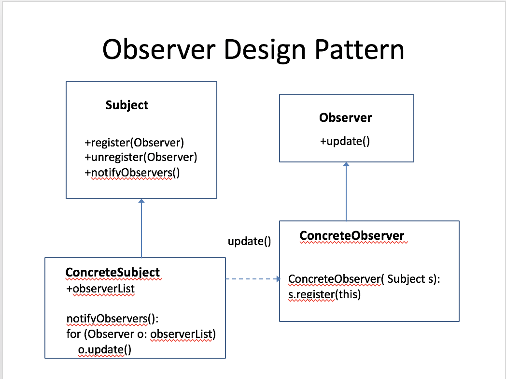

## when to use
you have a class(Subcriber) that wants to automatically follows the status or changes in the main class, and update its own behavior automatically. 

such as a broadcast system, every time there is a new update, it will update to all of its subscribers.

## how to use
