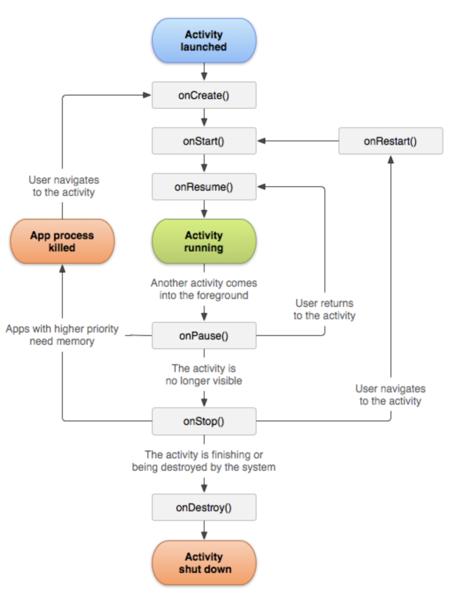

# Exception

```java
public​ ​class​ ​ExceptionsExample​ {
​   public​ ​static​ ​void​ ​main​(String[] args){
​       try​{
​           int​ a = quotientInt(​5​,​0​);
        }​catch​(ArithmeticException ex){ 
            ex.printStackTrace();
        } 
    }
​   public​ ​static​ ​int​ ​quotientInt​(​int​ a, ​int​ b){
​       return​ a / b; 
    }
​//write quotientDouble here later 
}
```
```java
public static double calculateExchangeRate(String A, String B)
        throws NumberFormatException, ArithmeticException {
    // NumberFormatException is automatically thrown if A or B is an empty string, and this will be thrown by valueof.
    // we only care about 0 and positive.
    if(Double.valueOf(B)<1e-10) throw new ArithmeticException();
    exchangeRate = Double.valueOf(A) / Double.valueOf(B);
    return exchangeRate;
    }
```

# Toast
How to construct toast
```java
Toast.makeText(MainActivity.​this​, R.string.warning_blank_edit_text,Toast.LENGTH_LONG).show();
```
Toast.LENGTH_LONG, Toast.LENGTH_SHORT is for appearing time for the toast.

## Logcat
- d​​ for debug
- w​​ for warning
- e​​ for error
- i​​ for info
In addition, every message has a tag for added filtering.

Typically, the apps we do are small apps, so we just stick to one of these levels.

A typical statement to print a message as follows:

```Log.i(TAG, ​"Empty String"​);```

# XML files
## res/values folder
Why do we need this:
1. Different parts of your app can use the same constants
2. changes can be made in one place instaed of trawling through your code.

```String.xml```: This is the file to store all the string names for App name or activity name, widget name, Toast messages. 

```colors.xml```: defines the colors, ```dimens.xml```: defines the dimens, ```styles.xml``` defines the styles.

String.xml look like:
```xml
<​string​​ name=​"app_name"​>​Exchange Rate​</​string​​>
<​string​​ name=​"action_settings"​>​Settings​</​string​​>
<​string​​ name=​"set_exchange_rate"​>​Set Exchange Rate​</​string​​> 
<​string​​ name=​"main_activity_name"​>​Convert Currency​</​string​​>
```
To access the constant in it, use ```R.string.someString```

## manifest.xml
it is in ```app/manifest/AndriodManifest.xml```

It stores all the important info about you app:
* App name
* App icon
* Activities you app contains
* permissions of you app, (e.g. accessing the internet)

everytime you add a new activity, you put this in:
```xml
<activity
    android:name=".SubActivity"
    android:label="@string/sub_activity_name"
    android:parentActivityName=".MainActivity" />
```
The ```andriod:parentActivity``` allows it to go back to its parent.

# EditText widget
```xml
<​EditText
android:id=​"@+id/editTextValue" 
android:hint=​"Enter amount" 
android:gravity=​"center" 
android:inputType=​"numberDecimal" 
android:layout_width=​"match_parent" 
android:layout_height=​"wrap_content"​ />
```
The ​android:hint​​ ​attribute displays a faint grey text telling the user what to enter in the box.

The ​android:inputType​​ attribute restricts the type of input into the box. Read the documentation on the allowable inputs.

# Intent
### explict intent
```java
Intent intent = ​new​ Intent(MainActivity.​this​, SubActivity.class); 
startActivity(intent);
```
The intent is launched by ```startActivity```

## passing data from different activities
To passing data from subactivity to main activity

In subActivity.java
```java
Intent intent = new Intent(subActivity.this, mainActivity.class);
intent.putExtra(KEY, value);
startActivity(intent);
```
In mainActivity.java
```java
Intent intent = getIntent();
double value = intent.getDoubleExtra(subActivity.KEY, defaultValue);
```


# Andriod Activity lifecycle
TODO: search for google, what does each callback called when we do what.



rewrite the arguments
```java
@Override
protected void onResume() {
    super.onResume();
    Log.i(TAG, "onResume() is created");
}
```


# SharedPereferences

rewriting onPause() When closing the app.
```java

private​ ​final​ String sharedPrefFile = "com.example.android.mainsharedprefs"​; 
public​ ​static​ ​final​ String KEY = ​"MyKey"​; 
SharedPreferences mPreferences;
@Override
protected​ ​void​ ​onCreate​(Bundle savedInstanceState) { ​
//other code not shown
    mPreferences = getSharedPreferences(sharedPrefFile,
                                        MODE_PRIVATE);
   String Rate_text = mPreferences.getString(KEY,defaultValue);
}

@Override
protected void onPause() {
    super.onPause();
    Log.i(TAG, "onPause() is created");

    // mPreferences is a interface and Shared PreferencesEditor is a inner interface
    SharedPreferences.Editor preferencessEditor = mPreferences.edit();
    preferencessEditor.putString(RATE_KEY, editTextValue.getText().toString());
    preferencessEditor.putString("exchange_rate", textViewExchangeRate.getText().toString());
    preferencessEditor.apply();
}
```
`mPereferences` is a built in class interface. `getSharedPreferences` is a method that is inherited from the super class, `AppCompactActivity`.

# option menu
the content is in  `res/xml`  file

Option menu the `toolbar` and onOptionsItemSelected
```java
public boolean onOptionsItemSelected(MenuItem item) {
    // Handle action bar item clicks here. The action bar will
    // automatically handle clicks on the Home/Up button, so long
    // as you specify a parent activity in AndroidManifest.xml.
    int id = item.getItemId();

    //noinspection SimplifiableIfStatement
    if (id == R.id.action_settings) {
        return true;
    }
    if (id == R.id.menu_set_exchange_rate) {
        // TODO write intent here
        Intent intent = new Intent(this, SubActivity.class);
        startActivity(intent);
        return true;
    }
    return super.onOptionsItemSelected(item);
}
```

# ToolBar
```
Toolbar toolbar = (Toolbar) findViewById(R.id.toolbar);
setSupportActionBar(toolbar);
```


# Floating action button
```java
FloatingActionButton fab = (FloatingActionButton) findViewById(R.id.fab);
fab.setOnClickListener(new View.OnClickListener() {
    @Override
    public void onClick(View view) {
        Snackbar.make(view, "Replace with your own action", Snackbar.LENGTH_LONG)
                .setAction("Action", null).show();
    }
});
```

# Universial Resource Indicators
Absolute URIs specify a scheme e.g.

- A document on the internet: ​http://www.google.com
- A file on your computer: ​file:/Users/Macintosh/Downloads/url.html
- A geographic location: ​geo:0.0?q=test
- An email: ​mailto: ​test@sutd.edu.sg

Hierachical URIs​​ have a slash character after the scheme and can be parsed as follows: 

[​scheme:​ ​​][authority]​[​path​][​?q​​ uery]​[​#f​​ragment/​/​]

Opaque URIs​​ do not have a slash characters and can be parsed as follows: 

[scheme : ][opaque part][? Query]

# Implict Intent
the code below is to lauch aMap App
1. build the URI to specify the location, we build it in this way, we can reduce the error
```java
String location = getString(R.string.​default_location​)​;
Uri.Builder builder = ​new​ Uri.Builder(); 
builder.scheme(​"geo"​).opaquePart(​"0.0"​).appendQueryParameter(​"q"​,locatio n);
Uri geoLocation = builder.build();
```
2. Intent.Action view specify a general action we want to achieve. and it is passed to the constructor
We also need to pass in the data we want to see, `geoLocation` that we build previously
```java
Intent intent = ​new​ Intent(Intent.ACTION_VIEW); 
intent.setData(geoLocation);
```
3. if there is such program, run the program
```java
if​( intent.resolveActivity(getPackageManager()) != ​null​){ 
    startActivity(intent);
}
```
For other intents, see [here](https://developer.android.com/guide/components/intents-common)

TODO: explain more on each line `resolveActvivity` mean.


# Test
### Unit Test with JUnit4
- Testing the parts that don’t involve the UI ​(easy)​​: ​unit testing
- Testing the parts that involve the UI (hard): ​instrumented testing

Test case Example
```java
@Test
public​ ​void​ ​exchangeRate_Default​(){
    assertEquals(​2.95​, ExchangeRate.calculateExchangeRate(),​0.001​); 
}

@Test​(expected= ArithmeticException.class) 
public​ ​void​ ​exchangeRate_Infinity​() {
    ExchangeRate.calculateExchangeRate(​"0.0"​,​"1.0"​); 
}
```

### Instrumented Test with Expresso
This helps user interaction with the app and see if the result is correct.

- Ensure that your widgets have certain properties.
- Carry out some action on your widgets

General formula for checking
```java
onView ( ​ViewMatcher​​ ).check( ​ViewAssertion​​ )
```
Examples
```java
@Test
public​ ​void​ ​exchangeRateZero​(){ onView(withId(R.id.buttonSetExchangeRate)).perform(click());
}

@Test
public void enterValueAndConvert() {
    onView(withId(R.id.editTextValue))
            .perform(replaceText("100"));
    onView(withId(R.id.buttonConvert))
            .perform(click());
    onView(withId(R.id.textViewResult))
            .check(matches(withText("295.0")));
}
```


### Menu layout
```java
@Override
public boolean onOptionsItemSelected(MenuItem item) {
    // Handle action bar item clicks here. The action bar will
    // automatically handle clicks on the Home/Up button, so long
    // as you specify a parent activity in AndroidManifest.xml.
    int id = item.getItemId();

    //noinspection SimplifiableIfStatement
    if (id == R.id.action_settings) {
        return true;
    }

    if (id == R.id.menu_set_exchange_rate) {
        // TODO write intent here
        Intent intent = new Intent(this, SubActivity.class);
        startActivity(intent);
        return true;
    }

    if (id == R.id.menu_map) {
        String location = getString(R.string.default_location);
        Uri.Builder builder = new Uri.Builder();
        builder.scheme("geo")
                .opaquePart("0.0")
                .appendQueryParameter("q", location);
        Uri geolocation = builder.build();

        Intent intent = new Intent(Intent.ACTION_VIEW);
        intent.setData(geolocation);
        if (intent.resolveActivity(getPackageManager())!=null) {
            startActivity(intent);
        }
    }
    return super.onOptionsItemSelected(item);
}
```

Extend more on exchange rate testing.

