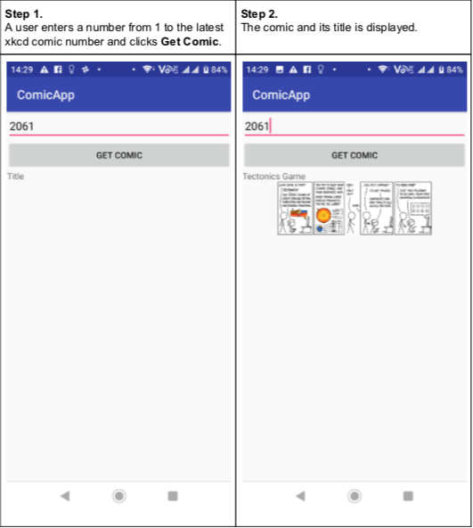
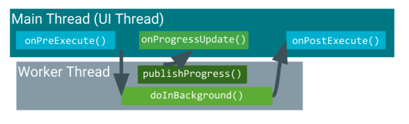
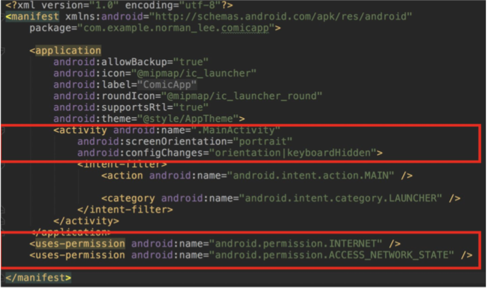

# Table of contents
- [AsyncTask](##AsyncTasks)
- [Modify the android Manifest to set permissions and fix the orientation](#Manifest)
- [Build an URL object](###Building-URL)
- [Download JSON data given a URL of an API call](##AsyncTasks)
- [Parse JSON data using the JSONObject class](##AsyncTasks)
- [Download an Image file given a URL](##AsyncTasks)


## App 
Github project: [lesson3](https://github.com/ISTD50001/lesson-3-Emrys-Hong/blob/master/app/src/main/java/com/example/norman_lee/comicapp/MainActivity.java)


## AsyncTasks 
When we are downloading pictures from the internet, the download should be a separate thread from UI.

Abstract class implements AsyncTasks allows tasks to run in the background.


```
doInBackground() ​​always carries out the background task e.g. downloading the image data from a URL.
Decide if you need ​onPreExecute()​​ - I have not found a reason to use it so far.
onPostExecute() ​​carries out the job to be done after the background task is complete. Suppose the task is to download an image given a URL, 
this is where you write code to display the image on the UI.
If you use ​publishProgress()​​ within d​ oInBackground()​​, decide how you want this information to be displayed on the UI using ​onProgressUpdate()
```

Code Example:
Write GetCommic Class in main activity
```java
ImageView imageViewComic;
class GetComic extends AsyncTask<URL, String, Bitmap>{
        @Override
        protected Bitmap doInBackground(URL... urls) {
            URL myUrl = urls[0];
            String JSONString = Utils.getJson(myUrl);
            Bitmap bitmap = null;

            try {
                JSONObject jsonObject = new JSONObject(JSONString);
                String safe_title = jsonObject.getString("safe_title");
                publishProgress(safe_title);
                // TODO display the title on the UI
                String img_url = jsonObject.getString("img");
                URL bitmapUrl = new URL(img_url);
                bitmap = Utils.getBitmap(bitmapUrl);

                URL bitmap_url = new URL(img_url);
            } catch (MalformedURLException ex) {
                // handle this later
                ex.printStackTrace();
                Toast.makeText(MainActivity.this, "JSON is faulty", Toast.LENGTH_LONG).show();
            } catch (JSONException ex) {
                // handle this later
                ex.printStackTrace();
                Toast.makeText(MainActivity.this, "Image URL is faulty", Toast.LENGTH_LONG).show();
            }
            return bitmap;
        }

        @Override
        protected void onProgressUpdate(String... values) {
            super.onProgressUpdate(values);
            // TODO displays the zeroth entry of the values
            textViewTitle.setText(values[0]);
        }

        @Override
        protected void onPostExecute(Bitmap bitmap) {
            super.onPostExecute(bitmap);
            if (bitmap != null) {
                imageViewComic.setImageBitmap(bitmap);
            }
        }
    }
```

Bind this method to a button, In View.onClicklistener:
```java
if (Utils.isNetworkAvailable(MainActivity.this)) {
    GetComic getComic = new GetComic();
    getComic.execute(url);
} else {
    Toast.makeText(MainActivity.this, "network is not available", Toast.LENGTH_LONG).show();
}
```

### Building-URL
In MainActivity class
```java
private URL buildURL(String comicNo){

    String scheme = "https";
    final String authority = "xkcd.com";
    final String back = "info.0.json";
    Uri.Builder builder;
    URL url = null;

    builder = new Uri.Builder();
    if (comicNo.equals("")) {

        builder.scheme(scheme)
                .authority(authority)
                .appendPath(back);
    } else{
        builder.scheme(scheme)
                .authority(authority)
                .appendPath(comicNo)
                .appendPath(back);
    } // no need if/else if empty wont append

    Uri uri = builder.build();

    try{
        url = new URL(uri.toString());
        Log.i(TAG,"URL OK: " + url.toString());
    }catch(MalformedURLException e) {
        Log.i(TAG, "malformed URL: " + url.toString());
    }

    return url;
}
```

### OnClickListener
```java
public void onClick(View v) {
    String comicNo = editTextComicNo.getText().toString();
    URL url = buildURL(comicNo);
    Log.i("url", url.toString());
    if (Utils.isNetworkAvailable(MainActivity.this)) {
        GetComic getComic = new GetComic();
        getComic.execute(url);
    } else {
        Toast.makeText(MainActivity.this, "network is not available", Toast.LENGTH_LONG).show();
    }
}
```

### facilitate functions
```java
public​ ​static​ String ​getJson​(URL url) 
public​ ​static​ Bitmap ​getBitmap​(URL url)
public​ ​static​ ​boolean​ ​isNetworkAvailable​(Context context)
```

## Manifest
Modifying manifest to:
1. Constrain the activity orientation
2. Access the internet
