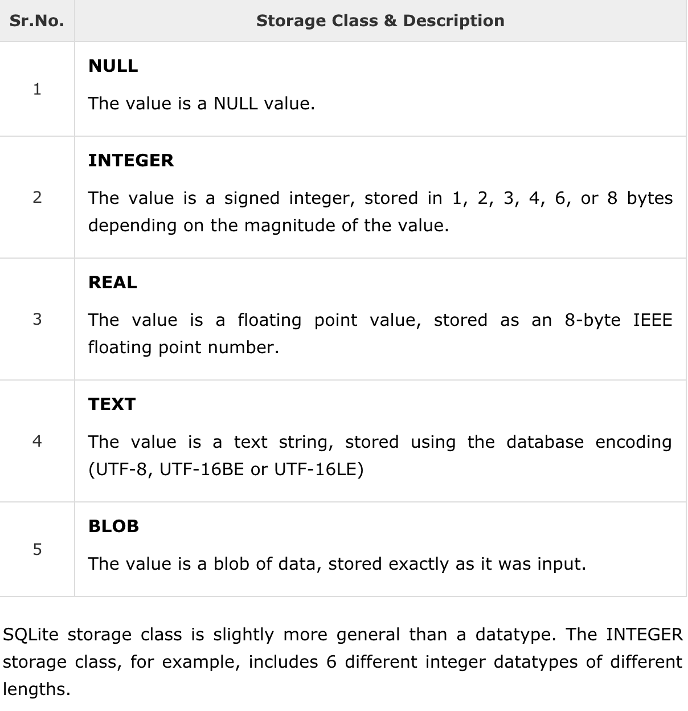

## Table of Contents


# Database
A relational database (“SQL database”) has its data stored in tables. The closest thing you might be familiar with is having data in a spreadsheet.

A non-relational database (“noSQL database”) has its data stored in other ways. One common way is using key-value pairs, which you would have encountered in Google firebase.

### Data class


## sqlite instruction
This class can also include methods for the database CRUD queries
- Creating records
- Reading or Querying records
- Updating records
- Deleting records
  

## create tables and insert values
```sql
CREATE TABLE SpendingRecord (_ID INTEGER PRIMARY KEY AUTOINCREMENT, Amount INTEGER NOT NULL, Remarks TEXT NOT NULL );
INSERT INTO SpendingRecord (Amount, Remarks) VALUES (10000, 'Man');
INSERT INTO SpendingRecord (Amount, Remarks) VALUES (20000, 'Norman');
INSERT INTO SpendingRecord (Amount, Remarks) VALUES (30000, 'Eric');
```
+ `_ID`: is specified as a `primary key` and is of `INTEGER` data type, A primary key is a unique entry that identifies each row in the table. e.g. Your student ID is a primary key. `AUTOINCREMENT` specify as each row is added, the primary key will increment by one.
+ `Amount`: is specified to be of `INTEGER` type and `NOT NULL` specifies that column is not allowed to be left empty.
+ `BLOB`: It is possible to use this datatype to store images.


### sql queries
```sql
SELECT * FROM SpendingRecord;
SELECT Remarks FROM SpendingRecord;
SELECT * FROM SpendingRecord WHERE Remarks = 'Eric';
SELECT * FROM SpendingRecord WHERE Amount > 15000;
SELECT * FROM SpendingRecord ORDER BY RANDOM() LIMIT 1;
SELECT * FROM SpendingRecord ORDER BY ASC;
SELECT * FROM SpendingRecord ORDER BY DESC;
```
+ `SELECT` columns: Select the columns to return. Use * to return all columns.
+ `FROM` table: Specify the table from which to get results.
+ `WHERE`: Keyword that precedes conditions that have to be met, for example column="value". Common operators are =, LIKE, <, and . To connect multiple conditions, use AND or OR.
+ `ORDER BY`: Specify ASC for ascending, or DESC for descending. For default order, omit ORDER BY.
+ `LIMIT`: Very useful keyword if you want to only get a limited number of results.


Further reading:
[Android Developer Fundamentals v2, Concept Reference, Section 10.0](https://google-developer-training.github.io/android-developer-fundamentals-course-concepts-v2/unit-4-saving-user-data/lesson-10-storing-data-with-room/10-0-c-sqlite-primer/10-0-c-sqlite-primer.html)

practise at: 
http://sqlfiddle.com


# SQLiteOpenHelper

## constructor
The singleton design pattern should also be used with this class,
as only one instance of the helper should be querying the database at any point in time.


Constructor: Your constructor should take in a Context object
and then:
call the super class constructor with:
1. the smae context object.
2. the table name
3. null for cursor table
4. The database version
```SQLiteOpenHelper(Context context, String name, SQLiteDatabase.CursorFactory factory, int version)``` Create a helper object to create, open, and manage a database.

code example:
```java
private CharaDbHelper(Context context){
    super(context, CharaContract.CharaEntry.TABLE_NAME, null, DATABASE_VERSION );
    this.context = context;
}

static CharaDbHelper createCharaDbHelper(Context context) {
    if (charaDbHelper == null) {
        charaDbHelper = new CharaDbHelper(context.getApplicationContext());
    }
    return new CharaDbHelper(context);
}
```
### Oncreate
"""

@input : An instance of SQLiteDatabase object is passed to it.

"""

you can also write:
+ Logcat to see when is this code executed
+ Logcat to populate this database with some entries.

```java
@Override
public void onCreate(SQLiteDatabase sqLiteDatabase) {
    sqLiteDatabase.execSQL(SQL_CREATE_TABLE);
    fillTable(sqLiteDatabase);
}
```

```java
public static String SQL_CREATE_TABLE = "CREATE TABLE" + SPACE
                + CharaEntry.TABLE_NAME + SPACE + "("
                + CharaEntry._ID + SPACE + "INTEGER PRIMARY KEY AUTOINCREMENT" + COMMA
                + CharaEntry.COL_NAME + SPACE + "TEXT NOT NULL" + COMMA
                + CharaEntry.COL_DESCRIPTION + SPACE + "TEXT NOT NULL" + COMMA
                + CharaEntry.COL_FILE + SPACE + "BLOB NOT NULL" + ");" ;
```
TODO: see the fill table method.


### Upgrade SQL Table
```java
public static String SQL_DROP_TABLE = "DROP TABLE IF EXISTS " + CharaEntry.TABLE_NAME;
```

```java
@Override
public void onUpgrade(SQLiteDatabase sqLiteDatabase, int i, int i1) {
    sqLiteDatabase.execSQL(CharaContract.CharaSql.SQL_DROP_TABLE);
    onCreate(sqLiteDatabase);
}
```

## Query one row
Using cursor
```java
public static String SQL_QUERY_ONE_RANDOM_ROW = "SELECT * FROM" + SPACE
                + CharaEntry.TABLE_NAME + SPACE
                + "ORDER BY RANDOM() LIMIT 1";
```


```java
// Query one row at random
public CharaData queryOneRowRandom(){
    if (readableDb == null) {
        readableDb = getReadableDatabase();
    }
    Cursor cursor = readableDb.rawQuery(CharaContract.CharaSql.SQL_QUERY_ONE_RANDOM_ROW, null);
    // give the first query
    return getDataFromCursor(0, cursor);
}

// query the first row
public CharaData queryOneRow(int position) {
        if (readableDb == null) {
            readableDb = getReadableDatabase();
        }
        Cursor cursor = readableDb.rawQuery(CharaContract.CharaSql.SQL_QUERY_ALL_ROWS, null);
        return getDataFromCursor(position, cursor); // the position is determined here
    }
```


# Using cursor object

## Query
- `moveToPosition()` method: is used once per row
- use `cursor.getColumnIndex(COL_NAME)` method to get column index
- use `getString` method to get data

--------------------------Example code----------------------------------------------
```java
cursor.moveToPosition(position);
int nameIndex = cursor.getColumnIndex(COL_NAME);
String name = cursor.getString(nameIndex);
```
____________________________________________________________________________________

--------------------------In practise----------------------------------------------
```java
private CharaData getDataFromCursor(int position, Cursor cursor){
        String name=null;
        String description =null;
        Bitmap bitmap =null;

        cursor.moveToPosition(position);
        int nameIndex = cursor.getColumnIndex(CharaContract.CharaEntry.COL_NAME);
        name = cursor.getString(nameIndex);

        int descriptionIndex = cursor.getColumnIndex(CharaContract.CharaEntry.COL_DESCRIPTION);
        description = cursor.getString(descriptionIndex);

        int bitmapIndex = cursor.getColumnIndex(CharaContract.CharaEntry.COL_FILE);
        // get Image as a byte object first
        byte[] bitmapdata = cursor.getBlob(bitmapIndex);
        // turn byte into a bitmap
        bitmap = BitmapFactory.decodeByteArray(bitmapdata, 0 , bitmapdata.length);
        return new CharaData(name, description, bitmap);
    }
```
____________________________________________________________________________________

## Inserting new rows
1. call `getWritableDatabase()`, which returns an SQLiteDatabase object. Usually the result is stored in an instance variable.
2. Create a new `ContentValues` object.
3. Use the `put` method on this object to put the data, with the column name as a key.
4. Call the `insert` method on the SQLiteDatabase object and provide the table
name and the ContentValues object as inputs.

--------------------------Example code----------------------------------------------
```java
if (writableDb == null) {
    writeableDb = getWritableDatabase();
}
ContentValues cv = new ContentValues();
cv.put(COL_NAME,  nameData);
writableDb.insert(TABLE_NAME, null, cv);
```
____________________________________________________________________________________

--------------------------In practise----------------------------------------------
```java
//TODO: Insert one row when data is passed to it
public void insertOneRow(CharaData charaData){
    if (writeableDb == null) {
        writeableDb = getWritableDatabase();
    }
    ContentValues contentValues = new ContentValues();
    contentValues.put(CharaContract.CharaEntry.COL_NAME,
            charaData.getName());
    contentValues.put(CharaContract.CharaEntry.COL_DESCRIPTION,
            charaData.getDescription());
    // use Utils to convert Bitmap into Byte array to insert into DB
    byte[] bitMapData = Utils.convertBitmapToByteArray(charaData.getBitmap());
    contentValues.put(CharaContract.CharaEntry.COL_FILE,
            bitMapData);
    // return row to see what is being inserted
    long row = writeableDb.insert(CharaContract.CharaEntry.TABLE_NAME, null, contentValues);
    Log.i("Logcat", "insertOneRow: row = " + row);
}
```

Utils.ConvertBitMap to byte array
```java
public static byte[] convertBitmapToByteArray(Bitmap bitmap){
    ByteArrayOutputStream stream = new ByteArrayOutputStream();
    bitmap.compress(Bitmap.CompressFormat.JPEG, 100, stream);
    return stream.toByteArray();
}
```
____________________________________________________________________________________


## Deleting new Rows
1. Call `getWritableDatabase()`, which returns an SQLiteDatabase object. Usually the result is stored in an instance variable.
2. Write your `where-clause` as a string. Notice what is placed after the equal sign.
3. `WHERE_Arguments` that replace the question mark are stored in a string array.
4. Call the delete method on the SQLiteDatabase object and provide the `table_name`, `where-clause` and `where-args`. This method returns the number of rows deleted.

--------------------------Example code----------------------------------------------
```java
if (writableDb == null) {
    writeableDb = getWritableDatabase();
}
String WHERE_CLAUSE = COL_NAME + " = ?";
String[] WHERE_ARGS = {name};
int rowsDeleted = writeableDb.delete(TABLE_NAME, WHERE_CLAUSE, WHERE_ARGS);
```
____________________________________________________________________________________

--------------------------In practise----------------------------------------------
```java
//TODO: Delete one row given the name field
public int deleteOneRow(String name){
    if (writeableDb == null) {
        writeableDb = getReadableDatabase();
    }
    String WHERE_CLAUSE = CharaContract.CharaEntry.COL_NAME + " = ?";
    String[] WHERE_ARGS = {name};
    int rowsDeleted = writeableDb.delete(
            CharaContract.CharaEntry.TABLE_NAME,
            WHERE_CLAUSE, WHERE_ARGS
    );
    return rowsDeleted;
}
```
____________________________________________________________________________________

# Util classes
## 1. CharaContract
To store and organize `string constants` together.
--------------------------In practise----------------------------------------------
```java
public class CharaContract {

    //TODO 7.1 Examine the static inner classes. No coding is needed

    //TODO 7.2 Prevent Instantiation of this Contract class
    private CharaContract(){

    }

    public static final class CharaEntry implements BaseColumns {

        public static final String TABLE_NAME = "Chara";
        public static final String COL_NAME = "name";
        public static final String COL_DESCRIPTION = "description";
        public static final String COL_FILE = "file";

    }

    public static final class CharaSql {

        public static String SPACE = " ";
        public static String COMMA = ",";

        public static String SQL_CREATE_TABLE = "CREATE TABLE" + SPACE
                + CharaEntry.TABLE_NAME + SPACE + "("
                + CharaEntry._ID + SPACE + "INTEGER PRIMARY KEY AUTOINCREMENT" + COMMA
                + CharaEntry.COL_NAME + SPACE + "TEXT NOT NULL" + COMMA
                + CharaEntry.COL_DESCRIPTION + SPACE + "TEXT NOT NULL" + COMMA
                + CharaEntry.COL_FILE + SPACE + "BLOB NOT NULL" + ");" ;

        public static String SQL_DROP_TABLE = "DROP TABLE IF EXISTS " + CharaEntry.TABLE_NAME;

        public static String SQL_QUERY_ONE_RANDOM_ROW = "SELECT * FROM" + SPACE
                + CharaEntry.TABLE_NAME + SPACE
                + "ORDER BY RANDOM() LIMIT 1";

        public static String SQL_QUERY_ALL_ROWS = "SELECT * FROM " + CharaEntry.TABLE_NAME;

    }
}
```
____________________________________________________________________________________

- Placing such information in `static` variables
- within `static final` inner classes can help to organize it.
- As the function of such classes is just to store data, instantiation ought to be prevented by making the constructor `private`.
- `static inner classes` groups related classes together.

## CharaData
- An `inner class` declared in the database helper class mimics the structure of each row of the table, and helps in passing data around.
- Bearing in mind that such `static classes` cannot `access non-static` variables of the enclosing class.
--------------------------In practise----------------------------------------------
```java
//TODO 7.3 Create a model class to represent our data
static class CharaData{

    private String name;
    private String description;
    private String file;
    private Bitmap bitmap;

    public CharaData(String name, String description, String file) {
        this.name = name;
        this.description = description;
        this.file = file;
    }

    public CharaData( String name, String description, Bitmap bitmap){
        this.name = name;
        this.description = description;
        this.bitmap = bitmap;
    }

    public Bitmap getBitmap() {
        return bitmap;
    }

    public String getDescription() {
        return description;
    }

    public String getFile() {
        return file;
    }

    public String getName() {
        return name;
    }
}
```
____________________________________________________________________________________

## Intents startActivityForResult()
### Recab
- `Explict intents` bring you from one activity to another. Data can be passed during
this process.
- `Implicit intents` bring you from one activity to a component in your app. You specify
the kind of component you want, and the android runtime fetches what is available.

## Steps
1. Declare your `request code`, a `final static integer` variable that contains a unique integer that identifies your particular intent.
This is necessary as your activity could have more than one call to `startActivityForResult()`
```java
public static int REQUEST_CODE_FAB = 1000;
```
2. Declare an explicit intent in the usual way.
```java
Intent intent = new Intent(MainActivity.this, DataEntryActivity.class);
startActivityForResult(intent, REQUEST_CODE_FAB);
```
3. A user action (e.g. clicking a button) brings the user back to the origin activity.
```java
Intent returnIntent = new Intent();
returnIntent.putExtra(KEY, value); //optional
setResult(Activity.RESULT_OK, returnIntent);
finish();
```
The first argument of setResult() is either
+ `Activity.RESULT_OK` if the user has successfully completed the tasks
+ `Activity.RESULT_CANCELED` if the user has somehow backed out
Therefore, you need to write your data twice.

TODO: If you have data to transfer, you are reminded that you can use the putExtra() method above. (Recall Lesson 2).

5. Back in the origin activity, override the callback onActivityResult() to listen out for the result and carry out the next task. Note the sequence of if-statements.
```java
@Override
protected void onActivityResult(int requestCode, int resultCode, Intent data) {
   if (requestCode == REQUEST_CODE_FAB) {
       if(resultCode == Activity.RESULT_OK){
           //if you use putExtra in Step 4, then you need this step
           double value = data.getDoubleExtra(DataEntryActivity.KEY, defaultValue);
           Toast.makeText(this,"Message",Toast.LENGTH_LONG).show();
       }
       if (resultCode == Activity.RESULT_CANCELED) {
           //Write your code if there's no result
        }
   }
}
```

TODO: If you have data transferred from step 4, you may retrieve this data on the intent object passed to this callback using the getDoubleExtra() method or other suitable methods(Recall Lesson 2).

Read more:
+ [Intents & Activities](https://google-developer-training.github.io/android-developer-fundamentals-course-concepts-v2/unit-1-get-started/lesson-2-activities-and-intents/2-1-c-activities-and-intents/2-1-c-activities-and-intents.html#gettingdatabackfromactivity)
+ [Getting result from activity](https://google-developer-training.github.io/android-developer-fundamentals-course-concepts-v2/unit-1-get-started/lesson-2-activities-and-intents/2-1-c-activities-and-intents/2-1-c-activities-and-intents.html#gettingdatabackfromactivity)
+ [Implict Intent to retrieve file](https://developer.android.com/guide/components/intents-common#GetFile)

Use implict intent to get a photo.
```java
static final int REQUEST_IMAGE_GET = 1;

public void selectImage() {
    Intent intent = new Intent(Intent.ACTION_GET_CONTENT);
    intent.setType("image/*");
    if (intent.resolveActivity(getPackageManager()) != null) {
        startActivityForResult(intent, REQUEST_IMAGE_GET);
    }
}

@Override
protected void onActivityResult(int requestCode, int resultCode, Intent data) {
    if (requestCode == REQUEST_IMAGE_GET && resultCode == RESULT_OK) {
        Bitmap thumbnail = data.getParcelable("data");
        Uri fullPhotoUri = data.getData();
        // Do work with photo saved at fullPhotoUri
        ...
    }
}
```

TODO: can use the following method to convert InputStream object into Bitmap object.
```java
InputStream inputStream = this.getContentResolver().openInputStream(data.getData());
bitmapSelected = Utils.convertStreamToBitmap(inputStream);
```

----------------------In Practise---------------------------------------------------
```java
public class DataEntryActivity extends AppCompatActivity {

    ImageView imageViewSelected;
    CharaDbHelper charaDbHelper;
    EditText editTextName;
    EditText editTextDescription;
    Bitmap bitmapSelected = null;
    SQLiteDatabase db;
    int REQUEST_CODE_IMAGE = 2000;

    @Override
    protected void onCreate(Bundle savedInstanceState) {
        super.onCreate(savedInstanceState);
        setContentView(R.layout.activity_data_entry);

        //TODO 8.4 Get a reference to the CharaDbHelper
        charaDbHelper = CharaDbHelper.createCharaDbHelper(this);
        //TODO 8.5 Get references to the widgets
        imageViewSelected = findViewById(R.id.imageViewFile);
        editTextDescription = findViewById(R.id.editTextDescriptionEntry);
        editTextName = findViewById(R.id.editTextDescriptionEntry);
        //TODO 8.6 when the selectImage button is clicked, set up an Implicit Intent to the gallery
        Button buttonSelectImage = findViewById(R.id.buttonSelectImage);
        buttonSelectImage.setOnClickListener(new View.OnClickListener() {
            @Override
            public void onClick(View v) {
                // we are defining an implict intent here
                Intent intent = new Intent();
                intent.setType("images/*");
                intent.setAction(Intent.ACTION_GET_CONTENT);
                startActivityForResult(intent, REQUEST_CODE_IMAGE);
            }
        });
        //TODO 8.8 when the OK button is clicked, add the data to the db


    }

    //TODO 8.7 Complete OnActivityResult so that the selected image is displayed in the imageView
    @Override
    public void onActivityResult(int requestCode, int resultCode, Intent data) {
        super.onActivityResult(requestCode, resultCode, data);

        if (requestCode == REQUEST_CODE_IMAGE && resultCode == Activity.RESULT_OK) {
            try{InputStream inputStream = this.getContentResolver().openInputStream(data.getData());
                bitmapSelected = Utils.convertStreamToBitmap(inputStream);
                imageViewSelected.setImageBitmap(bitmapSelected);
            } catch (FileNotFoundException ex) {
                ex.printStackTrace();
            }

        }
    }
}
```
--------------------------------------------------------------------

----------------------classical example of Data Entry-------------------------
```java
public class DataEntryActivity extends AppCompatActivity {

    ImageView imageViewSelected;
    CharaDbHelper charaDbHelper;
    EditText editTextName;
    EditText editTextDescription;
    Bitmap bitmapSelected = null;
    SQLiteDatabase db;
    int REQUEST_CODE_IMAGE = 2000;

    @Override
    protected void onCreate(Bundle savedInstanceState) {
        super.onCreate(savedInstanceState);
        setContentView(R.layout.activity_data_entry);

        //TODO 8.4 Get a reference to the CharaDbHelper
        charaDbHelper = CharaDbHelper.createCharaDbHelper(this);

        //TODO 8.5 Get references to the widgets
        editTextName = findViewById(R.id.editTextNameEntry);
        editTextDescription = findViewById(R.id.editTextDescriptionEntry);
        Button buttonSelectImage = findViewById(R.id.buttonSelectImage);
        imageViewSelected = findViewById(R.id.imageViewSelected);

        //TODO 8.6 when the selectImage button is clicked, set up an Implicit Intent to the gallery
        buttonSelectImage.setOnClickListener(new View.OnClickListener() {
            @Override
            public void onClick(View v) {
                Intent intent = new Intent();
                intent.setType("image/*");
                intent.setAction(Intent.ACTION_GET_CONTENT);
                startActivityForResult(intent, REQUEST_CODE_IMAGE);
            }
        });

        //TODO 8.8 when the OK button is clicked, add the data to the db
        Button buttonOK = findViewById(R.id.buttonOK);
        buttonOK.setOnClickListener(new View.OnClickListener() {
            @Override
            public void onClick(View v) {

                String name = editTextName.getText().toString();
                String description = editTextDescription.getText().toString();

                if( bitmapSelected == null){
                    Toast.makeText(DataEntryActivity.this,
                            "no image selected",
                            Toast.LENGTH_LONG).show();
                }else{

                    CharaDbHelper.CharaData charaData
                            = new CharaDbHelper.CharaData(name,description,bitmapSelected);
                    charaDbHelper.insertOneRow( charaData );

                    Toast.makeText(DataEntryActivity.this,
                            "inserting to database",
                            Toast.LENGTH_LONG).show();

                    //In MainActivity we started DataEntryActivity using startActivityForResult
                    //Hence,DataEntryActivity must return a result and hence this set of code
                    Intent returnIntent = new Intent();
                    setResult(Activity.RESULT_OK, returnIntent);
                    finish();
                }
            }
        });
    }

    //TODO 8.7 Complete OnActivityResult so that the selected image is displayed in the imageView
    @Override
    public void onActivityResult(int requestCode, int resultCode, Intent data) {
        super.onActivityResult(requestCode, resultCode, data);

        if( requestCode == REQUEST_CODE_IMAGE
                && resultCode == Activity.RESULT_OK){
            //do stuff here - recipe code follows, don't fret ..
            try{
                Uri uri = data.getData();
                InputStream inputStream = this.getContentResolver()
                        .openInputStream(uri);
                bitmapSelected = Utils.convertStreamToBitmap(inputStream);
                imageViewSelected.setImageBitmap(bitmapSelected);
            }catch(FileNotFoundException ex){
                ex.printStackTrace();
            }

        }
    }
}
```

TODO: see how normal explict intent behave


## Side functions
Is Network available
```java
public static boolean isNetworkAvailable(Context context) {

    ConnectivityManager connectivityManager
            = (ConnectivityManager) context.getSystemService(Context.CONNECTIVITY_SERVICE);
    NetworkInfo activeNetworkInfo = connectivityManager.getActiveNetworkInfo();
    boolean haveNetwork = activeNetworkInfo != null && activeNetworkInfo.isConnected();
    Log.i(UTILS_TAG, "Active Network: " + haveNetwork);
    return haveNetwork;
}
```
Get data from URI
```java
public static InputStream getInputStream(URL url){

    HttpURLConnection urlConnection = null;
    BufferedReader reader = null;
    InputStream inputStream = null;

    try{
        urlConnection = (HttpURLConnection) url.openConnection();
        urlConnection.setRequestMethod("GET");
        urlConnection.setDoInput(true);
        urlConnection.connect();
        inputStream = urlConnection.getInputStream();
    }catch(IOException e) {
        e.printStackTrace();
        inputStream = null;
    }

    return inputStream;

}
```
Convert Stream to Json
```java
public static String getJson(URL url){
    return convertStreamToString(getInputStream(url));
}
```


# Gradle
Gradle ​​is the software component that manages the build process for an android app. 
The build process begins from the source code and ends with the `APK` file.
The APK file can then be installed on any Android phone.

You may obtain the APK file in Android studio using
`Build​​ → ​Build APK(s)`

more information about [build process](https://developer.android.com/studio/build/)

Settings for the build process are stored in two `build.gradle` file:
+ the project level file
+ the module level file

## Gradle module level settings
project-level default settings are usually efficient.

Hence, we need to modify the module-level settings only.

First part shows information such as:
- Minimum API level
- Compile API level
- Target API level
You can adjust these levels if you need certain API levels.

```java
apply plugin: 'com.android.application'

android {
    compileSdkVersion 28
    defaultConfig {
        applicationId "com.example.norman_lee.displayingdatanew"
        minSdkVersion 15
        targetSdkVersion 28
        versionCode 1
        versionName "1.0"
        testInstrumentationRunner "android.support.test.runner.AndroidJUnitRunner"
    }
    buildTypes {
        release {
            minifyEnabled false
            proguardFiles getDefaultProguardFile('proguard-android.txt'), 'proguard-rules.pro'
        }
    }
}
```
The following shows the dependency you app has.
```java
dependencies {
    implementation fileTree(dir: 'libs', include: ['*.jar'])
    implementation 'com.android.support:appcompat-v7:28.0.0-rc02'
    implementation 'com.android.support.constraint:constraint-layout:1.1.3'
    implementation 'com.android.support:design:28.0.0-rc02'
    implementation 'com.android.support:recyclerview-v7:28.*'
    implementation 'com.android.support:cardview-v7:28.0.0'
    testImplementation 'junit:junit:4.12'
    androidTestImplementation 'com.android.support.test:runner:1.0.2'
    androidTestImplementation 'com.android.support.test.espresso:espresso-core:3.0.2'
}
```
`recycler view` and `card view` are not a part of default dependencies.

They were added in, adding them in downloads the packages if you are doing it for the first time.

# Recycler View
The ​RecyclerView​​ widget allows the user to scroll through the data.

This is done by loading each data item onto its own item in RecyclerView. 

A typical RecyclerView display is shown below.

## How to implement recycler view
1. add `implementation ​'com.android.support:recyclerview-v7:28.*'` to gradle file
2. Include the following widget tag in the Activity layout where you want to have the
recyclerView.
```java
<android.support.v7.widget.RecyclerView 
    android:id=​"@+id/charaRecyclerView" 
    android:layout_width=​"match_parent" 
    android:layout_height=​"match_parent"​ />
```
3. Assuming each data item is store in the `cardView` design the layout of each data item.
4. Decide the source of your data:
    + Stored in the res folder
    + SQLiteDatabase
    + Cloud Database
    + etc
    This lesson shows you how to use data from a local SQLiteDatabase.
5. Write an Adapter class that extends the ​`RecyclerView.Adapter<VH>​​` class.

    This class takes in your data source and is called by the Android runtime to display the data on the RecyclerView widget. 

    This class also references the data item that you designed in [step 3].
6. In the java file for your activity, write code for the following
    - Get a reference to the recyclerView widget using findViewById()
    - Get an instance of an object that points to your dataSource
    - Instantiate your Adapter
    - Attach the adapter to your recyclerView widget
    - Attach a Layout manager to your recyclerView widget. A LayoutManager governs
    how your widgets are going to be displayed. Since we are scrolling up and down, we will just need a LinearLayoutManager.

    Sample code is here
    ```java
    recyclerView = findViewById(R.id.charaRecyclerView); 
    dataSource = ??? ;
    charaAdapter = ​new​ CharaAdapter(​this​, dataSource ); 
    recyclerView.setAdapter(charaAdapter); 
    recyclerView.setLayoutManager(​new​ LinearLayoutManager(​this​));
    ```
    This way of coding show you how **delegation** is performed. **Delegation** is the transferring of tasks from one object to a related object.

    __RecyclerView__ object makes use of `Strategy Design Pattern` because:
    * the role of retrieving data to the `RecyclerView.Adapter` object.
    * the role of managing layout to the LinearLayoutManager.
    
## Writing `RecyclerView Adapter` -static inner class
The RecyclerView Adapter class is the adapter class between the RecyclerView widget and the object containing your source of data.

Your RecyclerView Adapter should extend the ​`RecyclerView.Adapter<VH>​​ class`. 

VH​​ is a generic class that subclasses ​`RecyclerView.ViewHolder`, which is an ​**abstract class​​** without abstract methods.

Hence, Android is forcing you to subclass this class to use its methods.

This class is meant to hold references to the widgets in each data item layout. Typically, we will write such a class as an inner class within the recyclerView adapter.
```java
public​ ​class​ CharaAdapter ​extends RecyclerView.Adapter<CharaAdapter.CharaViewHolder>{
    ​//code not shown
    ​static​ ​class​ CharaViewHolder ​extends​ RecyclerView.ViewHolder{
    ​//code not shown 
    }
}
```
Having designed your CardView layout for each data item, ​`CharaViewHolder​​` will contain `instance variables` that are meant to hold references to the widgets on the layout.
The references are obtained by calling ​`findViewById()​​` within the constructor.

## Writing the RecyclerView Adapter - write the constructor and override three methods

Constructor should take in 
- context object
- object for data source
The context object is used to get a layout inflator object to be used in `onCreateViewHolder()`

`RecyclerView.Adapter<VH>` is an abstract class and you have to override three subject methods.
1. `onCreateViewHolder()` is called by the run-time each time a new data item is added.
    
    In the code snippet below:
    - The CardView layout is inflated
    - A reference to the layout in memory is returned​ itemView
    - This reference ​itemView​​ is passed to the constructor of ​CharaViewHolder
    - CharaViewHolder​​ ​​uses this reference to get references to the individual widgets in
the layout

    Here is a typical recipe:
    ```java
    public CharaViewHolder ​onCreateViewHolder​(@NonNull ViewGroup viewGroup, ​int​ i) {
        View itemView = mInflater.inflate(R.layout.layout, viewGroup, false​);
    ​    return​ ​new​ CharaViewHolder(itemView); 
    }
    ```

2. `onBindViewHolder()` is meant to 
    - get the appropriate data from your data source
    - attach it to the widgets on each data item, according to the adapter position.
    Hence, the data on row 0 of a table goes on position 0 on the adapter and so on.

3. `getItemCount()​​` is meant to :
    return the total number of data items. Hence, if you return 0, nothing can be seen on the RecyclerView.

## TODO: get each item respond to clicks

## Swiping To Delete
We are able to write code to delete a particular ViewHolder when it is swiped left/right. 

The code recipe is to create an instance of `​ItemTouchHelper`
and attach the `RecyclerView` instance to it.


```java 
ItemTouchHelper itemTouchHelper = ​new​ ItemTouchHelper(simpleCallback);
itemTouchHelper.attach(recyclerView);
```
The constructor takes in an object that extends the ​ItemTouchHelper.SimpleCallback abstract class.
To use this class,
- Pass the direction of swiping that you want to detect to its constructor
- Override ​onSwipe()
From the documentation, the directions are specified via constants.

As you are going to use this object only once,

an acceptable practice is to use an anonymous abstract class.

As we are coding for swiping, we do not write any other code in ​`onMove()​​`.


```java
ItemTouchHelper.SimpleCallback simpleCallback = ​new ItemTouchHelper.SimpleCallback(​0​, ItemTouchHelper.LEFT | ItemTouchHelper.RIGHT ) {
    ​@Override
    ​public​ ​boolean​ ​onMove​(@NonNull RecyclerView recyclerView, @NonNull RecyclerView.ViewHolder viewHolder, @NonNull RecyclerView.ViewHolder viewHolder1) {
    ​   return​ ​false​; 
    }
    ​@Override
    ​public​ ​void​ ​onSwiped​(@NonNull RecyclerView.ViewHolder viewHolder, ​int​ i) {

    } 
}
```

Two parameters are passed to ​onSwiped()​​:
- an instance of the ViewHolder that is currently being swiped
- the direction (change the variable name of the autogenerated code ... )

The tasks are
+ Downcast​​ the ViewHolder object so that you can use the instance variables or
methods that you have defined
+ Call your database helper with the required information to delete the particular row in
the database
+ Display any other UI message e.g. a toast message saying a deletion has been
happening
+ Notify the RecyclerView adapter that the database has an item removed
(Where did the ​getAdapterPosition()​​ method come from? )

```java
CharaAdapter.CharaViewHolder charaViewHolder = (CharaAdapter.CharaViewHolder) viewHolder;
String name = charaViewHolder.textViewName.getText().toString();
charaDbHelper.deleteOneRow(name);
Toast.makeText(RecylerViewActivity.​this​, ​"Deleting "​ + name, Toast.LENGTH_LONG).show();
charaAdapter.notifyItemRemoved(viewHolder.getAdapterPosition());
```
# Card View
A useful widget that can display data in RecyclerView is the ​CardView​​ widget.

To use CardView, ensure that you have the following dependency in your module-level gradle file:

```java
implementation ​'com.android.support:cardview-v7:28.0.0'
```

CardView gives the “card look” to each item.
- You can change attributes to tweak the look of the cards.
- You then specify the layout of widgets within a CardView.
The following specify a cardView and layout within
```java
<​android.support.v7.widget.CardView 
    android:id=​"@+id/cardViewItem" 
    app:cardPreventCornerOverlap=​"false" 
    cardCornerRadius=​"5dp" 
    cardMaxElevation=​"1dp" 
    cardElevation=​"1dp" 
    cardUseCompatPadding=​"true" 
    android:layout_width=​"match_parent" 
    android:layout_height=​"100dp" 
    android:layout_margin=​"16dp"​>
    ​<​RelativeLayout
    android:id=​"@+id/ard" 
    android:layout_width=​"match_parent" 
    android:layout_height=​"match_parent"​>
    ​<​ImageView​​ /> ​
    <​TextView​​ /> ​
    <​TextView​​ /> ​
    <​TextView​​ />
    ​</​RelativeLayout​​> 
</​android.support.v7.widget.CardView​​>
```
