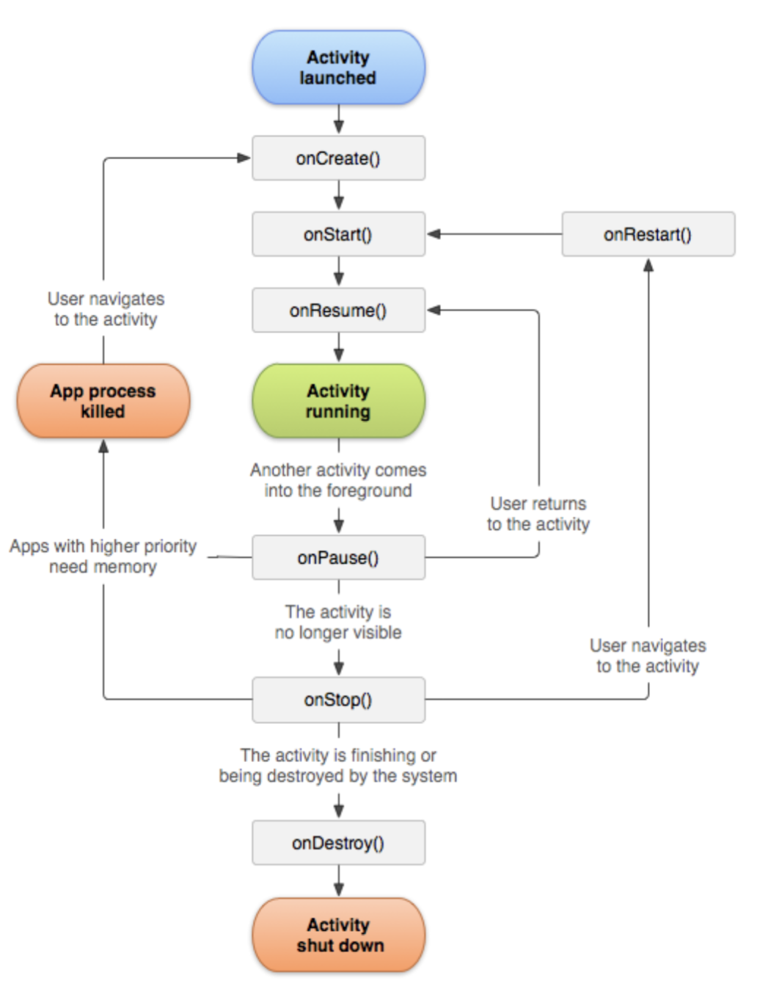
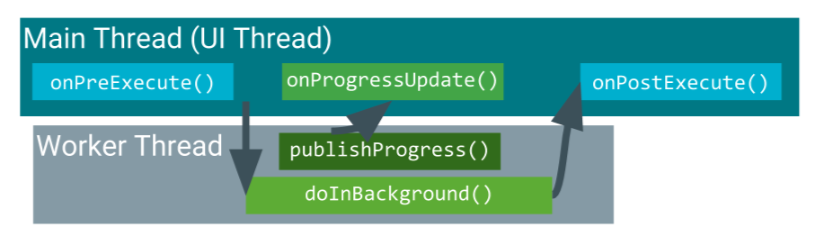

# Intent


1. `startActivityForResult()` -- Explict Intent:


    *** Code Example 1 ***
    
    In lesson4, From `MainActivity` to `DataEntryAcitivity` to get Image:
    
    In `MainActivity`, the type is `public static`:
    ```java
    public static int REQUEST_CODE_FAB = 1000;
    ```

    In `MainActivity Button.SetOnClickListener`:
    ```java
    Intent intent = new Intent(MainActivity.this,
                        DataEntryActivity.class);
    startActivityForResult(intent, REQUEST_CODE_FAB);
    ```

    In  `MainActivity` outside `onCreate`:
    ```java
    @Override
    protected void onActivityResult(int requestCode, int resultCode, Intent data) {
        if(requestCode == REQUEST_CODE_FAB){
            if(resultCode == Activity.RESULT_OK) {
                long numberOfRows = charaDbHelper.queryNumRows();
                Toast.makeText(MainActivity.this,
                        "Number of rows: " + numberOfRows,
                        Toast.LENGTH_LONG).show();
                }
                if(resultCode == Activity.RESULT_CANCELED){
                    //complete it yourself if you'd like
                }
        }
    }
    ```

    In `DataEntryActivity` in buttonOK.setOnClickListener:
    If the result is OK go back to MainActivity:
    ```java
    Intent returnIntent = new Intent();
    setResult(Activity.RESULT_OK, returnIntent);
    finish();
    ```


    *** Code Example 2 ***
    
    In `DataEntryActivity`:
    ```java
    int REQUEST_CODE_IMAGE = 2000;
    ```

    In `DataEntryActivity buttonSelectImage.setOnClickListener` to get Image from Pictures:
    
    ```java
    Intent intent = new Intent();
    intent.setType("image/*");
    intent.setAction(Intent.ACTION_GET_CONTENT);
    startActivityForResult(intent, REQUEST_CODE_IMAGE);
    ```

    In  `DataEntryActivity` outside `onCreate`
    , Notice it is Activity.RESULT_OK:
    ```java
    @Override
    public void onActivityResult(int requestCode, int resultCode, Intent data) {
        super.onActivityResult(requestCode, resultCode, data);
        if( requestCode == REQUEST_CODE_IMAGE
                && resultCode == Activity.RESULT_OK){
            //do stuff here - recipe code follows, don't fret ..
            try{
                Uri uri = data.getData();
                InputStream inputStream = this.getContentResolver()
                        .openInputStream(uri);
                bitmapSelected = Utils.convertStreamToBitmap(inputStream);
                imageViewSelected.setImageBitmap(bitmapSelected);
            }catch(FileNotFoundException ex){
                ex.printStackTrace();
            }
        }
    }
    ```


        
2. `Intent()` -- Explict Intent:
    *** Example code ***
    ```java
    Intent intent = new Intent( this, SubActivity.class);
    startActivity(intent);
    ```

3. `passing Data` -- Explict Intent:
    in put data activity,  the key is static :
    ```
    public final static String INTENT_EXCH_RATE = "Exchange Rate";
    ```

    put data activity:
    ```java
    Intent intent = new Intent(SubActivity.this, MainActivity.class);
    intent.putExtra(INTENT_EXCH_RATE, exchangeRate);
    startActivity(intent);
    ```

    get data activity at first few lines of `onCreate`:
    `getDoubleExtra` is for Double type, if it is String then will be `getStringExtra`
    ```java
    Intent intent = getIntent();
    exchangeRate = intent.getDoubleExtra(SubActivity.INTENT_EXCH_RATE, defaultValue);
    // if have shared Preferences, defaultValue need  to change
    ```

4. `Intent()` -- Implict Intent:
    geolocation is a Uri data.
    ```java
    Intent intent = new Intent(Intent.ACTION_VIEW);
    intent.setData(geoLocation);
    if (intent.resolveActivity(getPackageManager()) != null){
        startActivity(intent);
    }
    ```


# Shared Preferences

`sharedPrefFile`  is a regular string:

```java
private​ ​final​ String sharedPrefFile = "com.example.android.mainsharedprefs"​; 
public​ ​static​ ​final​ String KEY = ​"MyKey"​; 
SharedPreferences mPreferences;
@Override
protected​ ​void​ ​onCreate​(Bundle savedInstanceState) { ​
//other code not shown
    mPreferences = getSharedPreferences(sharedPrefFile,
                                        MODE_PRIVATE);
   String Rate_text = mPreferences.getString(KEY,defaultValue);
}
```
rewriting onPause() When closing the app.
```java
@Override
protected void onPause() {
    super.onPause();
    Log.i(TAG, "onPause() is created");
    // mPreferences is a interface and Shared PreferencesEditor is a inner interface
    SharedPreferences.Editor preferencessEditor = mPreferences.edit();
    preferencessEditor.putString(RATE_KEY, editTextValue.getText().toString());
    preferencessEditor.putString("exchange_rate", textViewExchangeRate.getText().toString());
    preferencessEditor.apply();
}
```
`mPereferences` is a built in class interface. `getSharedPreferences` is a method that is inherited from the super class, `AppCompactActivity`.


# option menu
the content is in  `res/xml`  file

Option menu the `toolbar` and onOptionsItemSelected
```java
public boolean onOptionsItemSelected(MenuItem item) {
    // Handle action bar item clicks here. The action bar will
    // automatically handle clicks on the Home/Up button, so long
    // as you specify a parent activity in AndroidManifest.xml.
    int id = item.getItemId();

    //noinspection SimplifiableIfStatement
    if (id == R.id.action_settings) {
        return true;
    }
    if (id == R.id.menu_set_exchange_rate) {
        // TODO write intent here
        Intent intent = new Intent(this, SubActivity.class);
        startActivity(intent);
        return true;
    }
    return super.onOptionsItemSelected(item);
}
```
usually come with this file, dont need to change
```java
@Override
public boolean onCreateOptionsMenu(Menu menu) {
    // Inflate the menu; this adds items to the action bar if it is present.
    getMenuInflater().inflate(R.menu.menu_main, menu);
    return true;
}
```

# ToolBar
In `onCreate` not important
```
Toolbar toolbar = (Toolbar) findViewById(R.id.toolbar);
setSupportActionBar(toolbar);
```

# Floating action button
```java
FloatingActionButton fab = (FloatingActionButton) findViewById(R.id.fab);
fab.setOnClickListener(new View.OnClickListener() {
    @Override
    public void onClick(View view) {
        // your action here
    }
});
```

# Andriod Activity lifecycle
TODO: search for google, what does each callback called when we do what.



rewrite the arguments
```java
@Override
protected void onResume() {
    super.onResume();
    Log.i(TAG, "onResume() is created");
}
```

# Log
- d​​ for debug
- w​​ for warning
- e​​ for error
- i​​ for info


In addition, every message has a tag for added filtering.

Typically, the apps we do are small apps, so we just stick to one of these levels.

A typical statement to print a message as follows:

```java
//i for info here
Log.i(TAG, ​"Empty String"​);
```

# Layout xml files

# Manifest
it is in ```app/manifest/AndriodManifest.xml```

It stores all the important info about you app:
* App name
* App icon
* Activities you app contains
* permissions of you app, (e.g. accessing the internet)

everytime you add a new activity, you put this in:
```xml
<activity
    android:name=".SubActivity"
    android:label="@string/sub_activity_name"
    android:parentActivityName=".MainActivity" />
```
The ```andriod:parentActivity``` allows it to go back to its parent.

# Button

# EditText
```xml
<​EditText
    android:id=​"@+id/editTextValue" 
    android:hint=​"Enter amount" 
    android:gravity=​"center" 
    android:inputType=​"numberDecimal" 
    android:layout_width=​"match_parent" 
    android:layout_height=​"wrap_content"​ />
```
The ​android:hint​​ ​attribute displays a faint grey text telling the user what to enter in the box.

The ​android:inputType​​ attribute restricts the type of input into the box. Read the documentation on the allowable inputs.

# ImageView
```xml
<ImageView
    android:id="@+id/charaImage"
    android:layout_width="match_parent"
    android:layout_height="200dp"
    android:src="@drawable/bartsimpson"/>
```

# Linear Layout
orientation is important
```xml
<LinearLayout xmlns:android="http://schemas.android.com/apk/res/android"
    xmlns:app="http://schemas.android.com/apk/res-auto"
    xmlns:tools="http://schemas.android.com/tools"
    android:layout_width="match_parent"
    android:layout_height="match_parent"
    android:orientation="vertical"
    tools:context=".MainActivity">
    // widgets here
</LinearLayout>
```

# cardView
```
implementation ​'com.android.support:cardview-v7:28.0.0'
```

```
<​android.support.v7.widget.CardView android:id=​"@+id/cardViewItem" app:cardPreventCornerOverlap=​"false" cardCornerRadius=​"5dp" cardMaxElevation=​"1dp" cardElevation=​"1dp" cardUseCompatPadding=​"true" android:layout_width=​"match_parent" android:layout_height=​"100dp" android:layout_margin=​"16dp"​>
​<​RelativeLayout
android:id=​"@+id/ard" android:layout_width=​"match_parent" android:layout_height=​"match_parent"​>
​<​ImageView​​ /> ​<​TextView​​ /> ​<​TextView​​ /> ​<​TextView​​ />
​</​RelativeLayout​​> </​android.support.v7.widget.CardView​​>
```

# Recycler
```
implementation ​'com.android.support:recyclerview-v7:28.*'
```

```

1. add `implementation ​'com.android.support:recyclerview-v7:28.*'` to gradle file
2. Include the following widget tag in the Activity layout where you want to have the
recyclerView.


```java
<android.support.v7.widget.RecyclerView 
    android:id=​"@+id/charaRecyclerView" 
    android:layout_width=​"match_parent" 
    android:layout_height=​"match_parent"​ />
```


# AsyncTasks 
When we are downloading pictures from the internet, the download should be a separate thread from UI.

Abstract class implements AsyncTasks allows tasks to run in the background.


```
doInBackground() ​​always carries out the background task e.g. downloading the image data from a URL.
Decide if you need ​onPreExecute()​​ - I have not found a reason to use it so far.
onPostExecute() ​​carries out the job to be done after the background task is complete. Suppose the task is to download an image given a URL, 
this is where you write code to display the image on the UI.
If you use ​publishProgress()​​ within d​ oInBackground()​​, decide how you want this information to be displayed on the UI using ​onProgressUpdate()
```

Code Example:
Write GetCommic Class in main activity
```java
ImageView imageViewComic;
class GetComic extends AsyncTask<URL, String, Bitmap>{
        @Override
        protected Bitmap doInBackground(URL... urls) {
            URL myUrl = urls[0];
            String JSONString = Utils.getJson(myUrl);
            Bitmap bitmap = null;

            try {
                JSONObject jsonObject = new JSONObject(JSONString);
                String safe_title = jsonObject.getString("safe_title");
                publishProgress(safe_title);
                // TODO display the title on the UI
                String img_url = jsonObject.getString("img");
                URL bitmapUrl = new URL(img_url);
                bitmap = Utils.getBitmap(bitmapUrl);

                URL bitmap_url = new URL(img_url);
            } catch (MalformedURLException ex) {
                // handle this later
                ex.printStackTrace();
                Toast.makeText(MainActivity.this, "JSON is faulty", Toast.LENGTH_LONG).show();
            } catch (JSONException ex) {
                // handle this later
                ex.printStackTrace();
                Toast.makeText(MainActivity.this, "Image URL is faulty", Toast.LENGTH_LONG).show();
            }
            return bitmap;
        }

        @Override
        protected void onProgressUpdate(String... values) {
            super.onProgressUpdate(values);
            // TODO displays the zeroth entry of the values
            textViewTitle.setText(values[0]);
        }

        @Override
        protected void onPostExecute(Bitmap bitmap) {
            super.onPostExecute(bitmap);
            if (bitmap != null) {
                imageViewComic.setImageBitmap(bitmap);
            }
        }
    }
```

Bind this method to a button, In View.onClicklistener:
```java
if (Utils.isNetworkAvailable(MainActivity.this)) {
    GetComic getComic = new GetComic();
    getComic.execute(url);
} else {
    Toast.makeText(MainActivity.this, "network is not available", Toast.LENGTH_LONG).show();
}
```


# Exception
